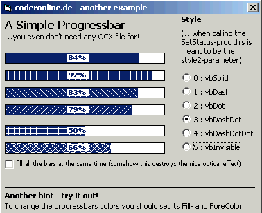

<div align="center">

## Another Progressbar without any OCX


</div>

### Description

It's just one Sub-Procedure that can fill a picturebox as if it was a progressbar. Also you can choose one of more than eight different styles!
 
### More Info
 
Just call SetStatus as shown in my example (only included in the zip-file!).

----

Call SetStatus() with the following Parameters:

1:   The real Name of a (normal) Picturebox included in your project

2:   Number of Percent to fill it with

and the following optional parameters are:

3:   specify a style (1 to 7) for "fullfilling"...

4:   specify a style (0 to 6) for the "lines-around" -can produce a 3D-effect

why i recommend you to use my code are the following facts:

- you dont need any OCX-File to use it

- it looks nice and gives your application an individual style

- my code does not run as slow as many others I have seen here *urgh* :-)

a -hopefully- nicelooking progressbar


<span>             |<span>
---                |---
**Submitted On**   |
**By**             |[Max Christian Pohle](https://github.com/Planet-Source-Code/PSCIndex/blob/master/ByAuthor/max-christian-pohle.md)
**Level**          |Beginner
**User Rating**    |4.7 (33 globes from 7 users)
**Compatibility**  |VB 3\.0, VB 4\.0 \(16\-bit\), VB 4\.0 \(32\-bit\), VB 5\.0, VB 6\.0
**Category**       |[Coding Standards](https://github.com/Planet-Source-Code/PSCIndex/blob/master/ByCategory/coding-standards__1-43.md)
**World**          |[Visual Basic](https://github.com/Planet-Source-Code/PSCIndex/blob/master/ByWorld/visual-basic.md)
**Archive File**   |[](https://github.com/Planet-Source-Code/max-christian-pohle-another-progressbar-without-any-ocx__1-52978/archive/master.zip)

### API Declarations

Sure that you -could- use APIs and please implement some if you want my progressbar to be transparent or anything. But don't be cruel and think my bar would be faster using them! :-)


### Source Code

```

Sub SetStatus(Progressbar As Object, Percent As Integer, Optional Style As Integer, Optional Style2 As Integer)
  Progressbar.AutoRedraw = True
  Progressbar.Cls
  Progressbar.FontTransparent = True
  Progressbar.Tag = Percent
  Progressbar.ScaleWidth = 100
  Progressbar.ScaleHeight = 10
  Progressbar.DrawStyle = Style2
  Progressbar.DrawMode = 13
  Progressbar.FillStyle = Style
  Progressbar.Line (0, 0)-(Percent, Progressbar.ScaleHeight - 1), , BF
  Progressbar.Line (0, 0)-(Percent, Progressbar.ScaleHeight - 1), , B
  Progressbar.FontTransparent = False
  Progressbar.CurrentX = 50 - Progressbar.TextWidth(Percent & "%")
  Progressbar.CurrentY = (Progressbar.ScaleHeight / 2) - (Progressbar.TextHeight(Percent & "%") / 2)
  Progressbar.FontBold = True
  Progressbar.FontSize = 7
  Progressbar.FontName = "Tahoma"
  Progressbar.Print " " & Percent & "% "
End Sub
```

